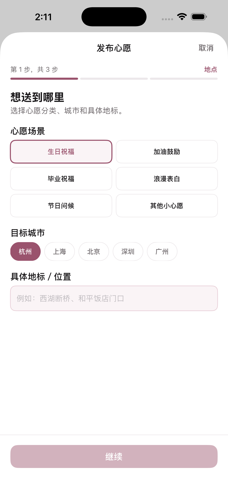
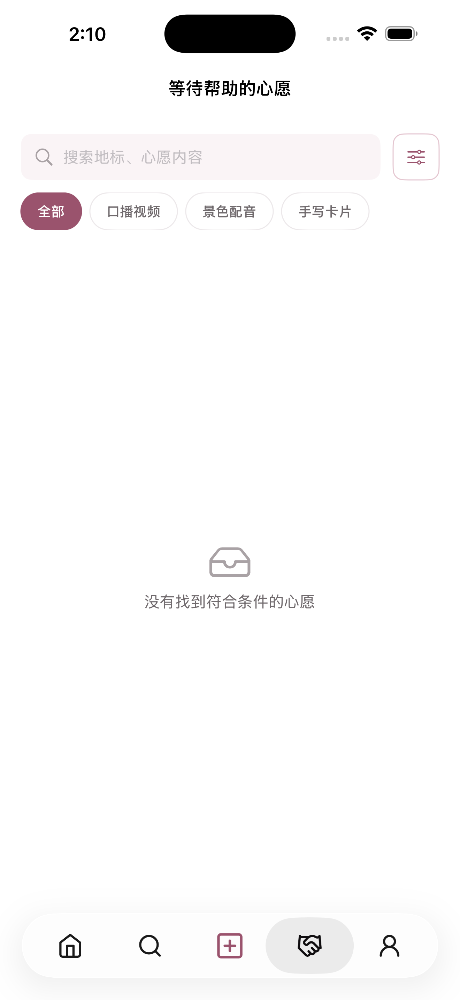
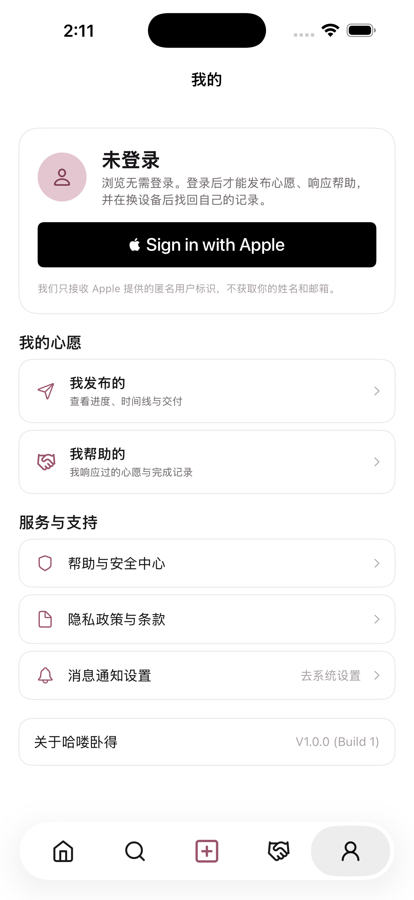
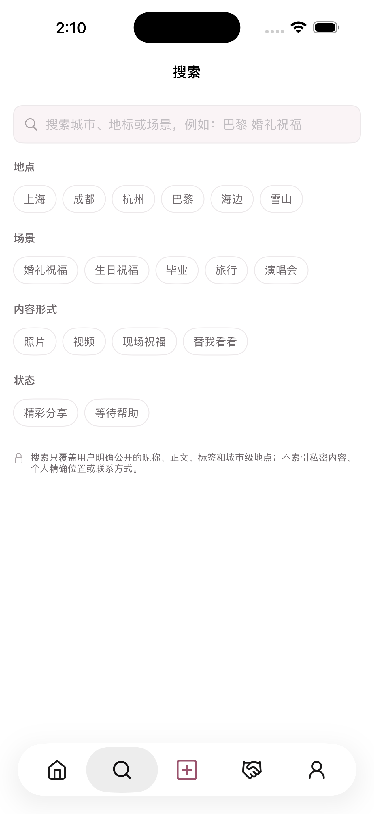

# 哈喽卧得 · Gratia

**替一个去不了现场的人，把一件小事完成在那个地方。**

你写下地点和想说的话，一个正好在那座城市的人接下它，到现场拍一张、录一段或写一张卡片，再交回你手里。不涉及金额，不交换联系方式，不申请定位。

<p>
  
  
  
  
</p>

| | |
| --- | --- |
| 角色 | 产品负责人：定义、取舍、验收；代码由多个 AI 编码代理按任务协议实现 |
| 周期 | 2025.09 课题立项（跨境电商课程结项路演 99/100）→ 2026.07–08 独立开发 → 2026.08 复盘止损 |
| 规模 | 原生 SwiftUI 约 1.1 万行，220+ 次提交，后端测试 30/30、iOS 测试 29/29 |
| 交付 | 构建 16 已上传 App Store Connect 并进入 TestFlight 外部测试 |
| 状态 | **已停止运营**。获客壁垒与成本复盘后主动止损，仓库保留作为完整的产品案例 |

## 几个关键决策

完整的决策记录在 [docs/iteration-log.md](docs/iteration-log.md)，每条都写了当时的处境、决定、理由、结果和没验证的部分。挑四条：

- **把运营从闭环里拿掉。** 最初的匹配、沟通和交付都由运营手工完成，于是运营成了唯一同时握有双方微信和手机号的一方，中介本身就是最大的隐私暴露面。后来改成双方在 App 内私聊并直接交付，服务端刻意不向发布者返回响应者的联系方式，并用测试断言把这一点固定下来。
- **四类内容审核补齐。** 排查出三处漏洞：故事公开绕过了对交付影像的审核；举报只进不出，没有处理接口；资料审核只有接口没有界面。补上以后，运营只有在收到一条具体举报时才能打开对应的私聊，不能随意翻看。
- **小程序和 iOS 之间来回，但数据模型没重做。** 为了省下 Apple 开发者年费，先转去做微信小程序，做到可以提审时，卡在了个人主体资质上，于是又回到 App Store。之所以两次转向都没有重做数据，是因为账号层一开始就按不绑定平台的方式设计：回到 iOS 时只需加一个 Apple 登录方式。
- **「不做」清单。** 不做支付，不做点赞数，不申请定位，不收集联系方式。每一条都是有意的取舍，不是没来得及做，详见 [产品说明](docs/project-overview.md)。

## 技术结构

```text
ios/            SwiftUI 客户端（iOS 18+），XcodeGen 生成工程，本地 Swift Package 承载领域层
worker/         Cloudflare Worker：公开 API、账户、私聊、交付、审核
server/         Worker 使用的仓储层与通知（Apple 登录、推送、限流）
drizzle/        D1 数据库迁移
app/            Next.js 运营台与历史网页原型（GitHub Pages）
miniprogram/    微信小程序 0.1 上线候选（已回退，保留）
tests/          后端与部署配置测试（node --test）
docs/           产品说明、架构、API 契约、验收清单、迭代记录
```

- 数据存在 D1，交付文件存在 R2，交付文件通过随机能力令牌访问
- 支持 Sign in with Apple，删除账户时撤销 Apple 令牌（App Store 审核会实测这一项）
- [scripts/ios-release.mjs](scripts/ios-release.mjs)：归档、校验产物签名、导出、验证、上传。这个脚本是为了避开两个会报"成功"却产出无签名包的坑写的

## AI 协同开发方式

这个项目由一个人主导，多个 AI 编码代理（Codex、Claude、Gemini）并行实现。协作方式记在仓库里：

- [AGENTS.md](AGENTS.md)：代理的角色、写入边界、验收门槛
- [.ai/](.ai/)：任务板、交接单、写入冻结规则。每个任务在独立的 worktree 完成，由负责人验收后再合入
- [docs/agent-delivery-quality-gate.md](docs/agent-delivery-quality-gate.md)：交付质量门
- [PROJECT_LOG.md](PROJECT_LOG.md)：只追加的验收证据，包括命令输出、测试数和 commit SHA

## 本地运行

见 [docs/DEVELOPMENT.md](docs/DEVELOPMENT.md)。

---

[Hansel Zhang](https://github.com/hanselzzh-Wow) · [hanselzhang.com](https://www.hanselzhang.com)
